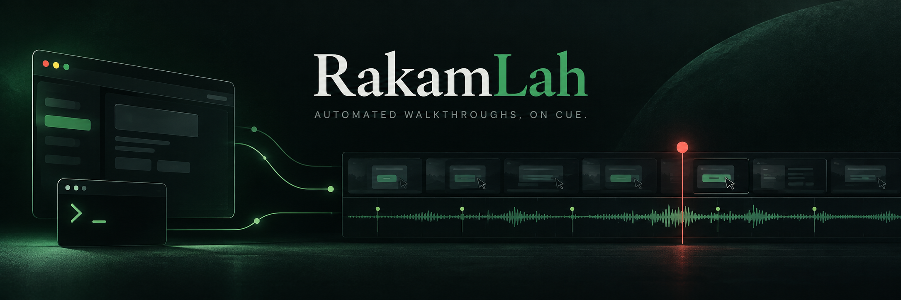
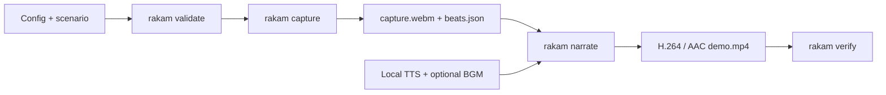

<p align="center">
  
</p>

# RakamLah

RakamLah is TolongLabs' open-source recording suite for repeatable browser walkthroughs. It coordinates Playwright
capture, visible beat timing, local speech synthesis, compact subtitles, background music, FFmpeg composition, and
deliverable verification through one portable headless interface.

|                  |                                                                                           |
| ---------------- | ----------------------------------------------------------------------------------------- |
| **Release**      | `v0.1.0` public alpha                                                                     |
| **Ships now**    | Headless CLI, scenario adapters, browser capture, local TTS, subtitles, BGM, verification |
| **Output**       | H.264 video, AAC audio, run-scoped artifacts, and machine-readable results                |
| **Requirements** | Node.js 20.11+, Bash, Python 3, Playwright/Chromium, FFmpeg/FFprobe, and Git LFS          |
| **License**      | MIT code, preserved third-party licenses, and separate terms for bundled media            |

---

## The Rule That Shapes This Repo

> **RakamLah owns capture and media orchestration. The application being recorded owns its walkthrough.**

URLs, authentication, selectors, fixtures, narration, and proof assertions live in a small scenario adapter beside the
consuming application. Browser timing, linear motion, beat metadata, speech scheduling, subtitle layout, audio mixing,
and output verification stay inside RakamLah. That boundary keeps the suite portable across frameworks, products, and
agent runtimes.

---

## Start Here

| Document                                       | What's in it                                                    |
| ---------------------------------------------- | --------------------------------------------------------------- |
| [`architecture.md`](architecture.md)           | Pipeline stages, boundaries, artifacts, and failure model       |
| [`configuration.md`](configuration.md)         | Complete config, narration, and scenario-adapter reference      |
| [`agent-integration.md`](agent-integration.md) | Stable headless usage, JSON output, exit codes, and recovery    |
| [`porting.md`](porting.md)                     | A practical path for adding RakamLah to any browser application |
| [`voices.md`](voices.md)                       | Kokoro and Chatterbox setup, caching, and responsible voice use |
| [`../examples/basic/`](../examples/basic/)     | Self-contained local site and a real end-to-end scenario        |
| [`../AGENTS.md`](../AGENTS.md)                 | Canonical instructions for contributors and coding agents       |

Planned work lives in the [GitHub issue tracker](https://github.com/TolongLabs/RakamLah/issues). Interactive CLI/TUI
editing, live subtitle previews, richer audio controls, filters, chapter recapture, and advanced quality checks are
roadmap items—not v0.1 features.

---

## How It Works



The scenario marks named moments while Playwright records. Narration lines name those same moments. RakamLah measures
each generated WAV, prevents lines from talking over one another, and rejects speech that would describe the next
screen too early. Subtitles are derived from the same manifest, so the words on screen and in the dub cannot drift
independently.

Each run gets its own output directory:

```text
.rakam/out/<run-id>/
  capture.webm            raw Playwright recording
  beats.json              ordered visual timestamps
  lines.json              resolved narration schedule
  seg/*.wav               synthesized speech segments
  narration.wav           mixed voice timeline
  narration.srt           compact subtitle cards
  capture-normalized.mp4  fitted output canvas
  demo.mp4                verified deliverable
```

---

## Getting Started

### 1. Install the host tools

Install Node.js 20.11 or newer, Bash, Python 3, FFmpeg with `libx264` and the `subtitles` filter, and Git LFS. Then:

```bash
git lfs install
git clone https://github.com/TolongLabs/RakamLah.git
cd RakamLah
git lfs pull
corepack pnpm install --frozen-lockfile
corepack pnpm exec playwright install chromium
```

### 2. Configure a local voice engine

Choose either Kokoro or Chatterbox using [`voices.md`](voices.md). Models and caches stay outside Git. The reviewed
Chatterbox dependency set currently requires Python 3.14; Kokoro and the core media scripts do not. `doctor` checks the
selected engine, so install its Python packages and local model files before expecting a clean diagnostic.

### 3. Diagnose, validate, and capture the local example

```bash
node bin/rakam.mjs doctor --config examples/basic/rakam.config.mjs --json
node bin/rakam.mjs validate --config examples/basic/rakam.config.mjs --json
node bin/rakam.mjs capture --config examples/basic/rakam.config.mjs --json
```

The example serves its own synthetic site on an ephemeral loopback port, performs a realistic form-to-result flow, and
shuts the server down after recording. It makes no remote request. If you prefer an installed Chrome channel, set
`RAKAM_BROWSER_CHANNEL=chrome` before the command. Once the diagnostic passes:

```bash
node bin/rakam.mjs run --config examples/basic/rakam.config.mjs --json
```

`run` captures, narrates, and verifies one run directory. For faster iteration, call `capture` once, then repeat
`narrate` and `verify`; both select the newest compatible run when invoked independently.

---

## Commands

Every command accepts `--config <path>` and `--json`.

| Command    | Purpose                                                             | Success artifacts              |
| ---------- | ------------------------------------------------------------------- | ------------------------------ |
| `doctor`   | Check host tools, Chromium launch, FFmpeg features, TTS, and inputs | Dependency report              |
| `validate` | Import config and validate the scenario's exported contract         | Beat and lifecycle-hook report |
| `capture`  | Record the scripted browser flow and timestamp every visible beat   | `capture.webm`, `beats.json`   |
| `narrate`  | Synthesize, schedule, subtitle, mix, and encode the newest capture  | `demo.mp4` and media sidecars  |
| `run`      | Execute capture → narrate → verify against one run directory        | Verified deliverable           |
| `verify`   | Check duration, dimensions, H.264, AAC, audio, and required beats   | Verification report            |

With `--json`, stdout contains exactly one JSON object and the process never prompts. A process-isolated worker routes
config, adapter, and child-process diagnostics to stderr, including direct writes to file descriptor 1. This is the
stable integration surface for shell scripts, CI, and coding agents. Exit codes are intentionally small and documented in
[`agent-integration.md`](agent-integration.md).

---

## A Portable Adapter, Not a Framework Plugin

RakamLah does not require a particular frontend stack, router, API, hosting provider, or test framework. A scenario is
an ESM file that exports an ordered beat list and a `walk` function:

```js
export const expectedBeats = ['welcome', 'action', 'outcome']

export const walk = async ({ page, mark, hold, linearScroll }) => {
  await page.goto(process.env.RECORDING_URL)
  mark('welcome')
  await hold('welcome')

  await page.getByRole('button', { name: 'Create report' }).click()
  mark('action')
  await hold('action')

  await page.getByRole('heading', { name: 'Report ready' }).waitFor()
  await linearScroll(page, page.getByRole('heading', { name: 'Report ready' }))
  mark('outcome')
  await hold('outcome')
}
```

Optional `warmup`, `audit`, and `cleanup` hooks support cold services, proof checks, and scenario-owned resources. The
browser engine has no knowledge of the application's selectors or claims.

---

## Built for Agents

RakamLah's automation boundary is deliberately vendor-neutral: a process needs only the ability to invoke a command,
read an exit code, and parse JSON. No proprietary plugin, interactive terminal, or hidden state is required.

```bash
node bin/rakam.mjs doctor --config ./rakam.config.mjs --json
node bin/rakam.mjs validate --config ./rakam.config.mjs --json
node bin/rakam.mjs run --config ./rakam.config.mjs --json
```

The repository also includes one concise [`AGENTS.md`](../AGENTS.md), small runtime-specific pointers, product-neutral
local skills, and guarded Git hooks. The planned interactive TUI will remain a client of these same headless commands,
so human controls and agent controls do not become separate implementations.

---

## Bundled Audio

`media/bgm/` contains a long-form lo-fi suite and cue sheet. `media/voices/` contains two Chatterbox reference samples.
The files are tracked through Git LFS and listed with exact sizes, durations, formats, and SHA-256 hashes in
[`../media/manifest.json`](../media/manifest.json).

```bash
node scripts/check-media.mjs
git lfs ls-files
```

TolongLabs-authored code is MIT licensed; vendored agent tooling keeps its upstream terms in
[`THIRD_PARTY_NOTICES.md`](../THIRD_PARTY_NOTICES.md). The manifest-listed media can be used and redistributed without
attribution or royalty under the [bundled media terms](../media/LICENSE.md), with the underlying maintainer attestation
recorded in [`media/AUTHORIZATION.md`](../media/AUTHORIZATION.md). Voice synthesis is also governed by the
[Responsible Use Policy](../RESPONSIBLE_USE.md).

---

## Repository Layout

```text
.agents/                  product-neutral repository skills
.claude/                  runtime pointers and guarded hooks
.github/                  CI, ownership, issue forms, and PR template
assets/                   README artwork
bin/                      executable entrypoint
docs/                     this README and focused references
engine/browser/           Playwright recording, beats, and linear motion
engine/media/             speech, scheduling, subtitles, and FFmpeg
examples/basic/           synthetic local walkthrough
media/bgm/                redistributable music through Git LFS
media/voices/             redistributable voice references through Git LFS
scripts/                  public-content and media checks
src/                      config, dispatch, commands, and result handling
tests/                    Node and Python behavior tests
AGENTS.md                 canonical contributor instructions
```

There is exactly one README, and it lives in `docs/`. GitHub renders a README from that directory as the repository
landing page while the root remains focused on executable and community files.

---

## Contributing and Releases

Start with [`CONTRIBUTING.md`](../CONTRIBUTING.md), follow the [Code of Conduct](../CODE_OF_CONDUCT.md), and report
security issues through the private route in [`SECURITY.md`](../SECURITY.md). Runtime changes are developed test-first;
media additions require explicit redistribution and voice-consent confirmation.

```bash
corepack pnpm test
corepack pnpm lint
```

RakamLah follows semantic versioning. Release notes and source archives are published on the
[GitHub releases page](https://github.com/TolongLabs/RakamLah/releases).

---

<p align="center">
  <sub>Built in the open by <a href="https://github.com/TolongLabs">TolongLabs</a>.</sub>
</p>
